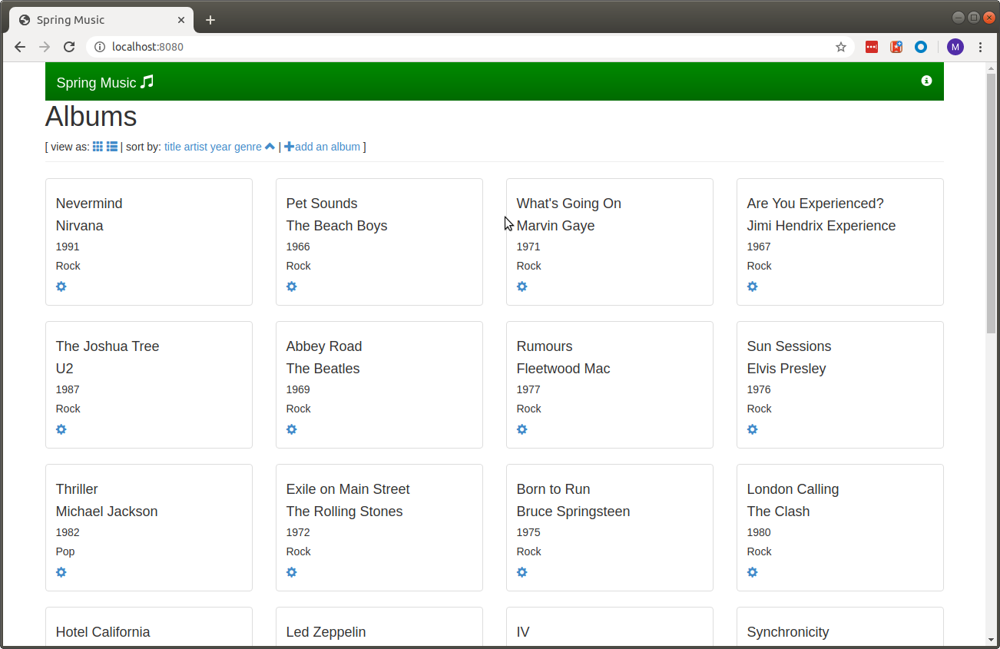

# Scenario 1
In this section we will build and deploy **spring-music** application locally.

## Building the application
This project requires Java 8 to compile. It will not compile with Java 9 or later. Make sure that you have java 8 available on your environment by running `java -version` command.
The first line of the output should be something like this - `openjdk version "1.8.0_252"`

To build a runnable Spring Boot jar file, run the following command:
```
$ ./gradlew clean assemble
```
The successful run of the above command should produce a jar file, running `file build/libs/spring-music-1.0.jar` command to verify, should produce the following output:
```
$ file build/libs/spring-music-1.0.jar
build/libs/spring-music-1.0.jar: Zip archive data, at least v2.0 to extract
$
```

## Running the application locally
One Spring bean profile should be activated to choose the database provider that the application should use. The profile is selected by setting the system property spring.profiles.active when starting the app.

The application can be started locally using the following command:
```
$ java -jar -Dspring.profiles.active=<profile> build/libs/spring-music-1.0.jar
```

where `<profile>` is one of the following values:

 - `mysql`
 - `postgres`
 - `mongodb`
 - `redis`

 If no profile is provided, an in-memory relational database will be used. If any other profile is provided, the appropriate database server must be started separately. Spring Boot will auto-configure a connection to the database using it's auto-configuration defaults. The connection parameters can be configured by setting the appropriate [Spring Boot properties](http://docs.spring.io/spring-boot/docs/current/reference/html/common-application-properties.html).

 If more than one of these profiles is provided, the application will throw an exception and fail to start.

 So, lets run the app without specifying a profile (e.g. the default profile that uses in-memory database will be activated)

 ```
 $ java -jar build/libs/spring-music-1.0.jar
 ```

 You should be able to access the application on this url - [http://localhost:8080](http://localhost:8080) and you should be able to see something like this: 
