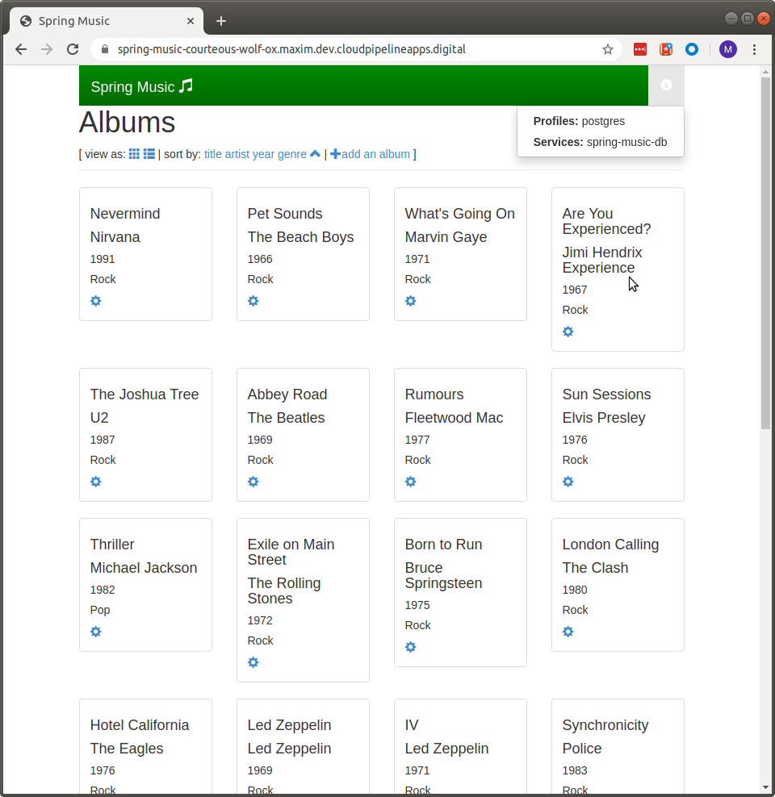

# Scenario 2
In this section we will deploy **spring-music** application to a Cloud Foundry and bind (e.g.: connect) to one or more persistence services. To accomplish this scenario you will require an access to a Cloud Foundry instance. To get and setup access to a Cloud Foundry instance is out of scope for this scenario.

We will use the application that we've built in [Scenario 1](../scenario-01/readme.md)

## Running the application on Cloud Foundry
When running on Cloud Foundry, the application will detect the type of database service bound to the application (if any). If a service of one of the supported types (MySQL, Postgres, MongoDB, or Redis) is bound to the app, the appropriate Spring profile will be configured to use the database service. The connection strings and credentials needed to use the service will be extracted from the Cloud Foundry environment.

If no bound services are found containing any of these values in the name, an in-memory relational database will be used.

If more than one service containing any of these values is bound to the application, the application will throw an exception and fail to start.

After installing the 'cf' [command-line interface for Cloud Foundry](http://docs.cloudfoundry.org/cf-cli/), targeting a Cloud Foundry instance, and logging in, the application can be built and pushed using these commands:
 - If you haven't built the application in the previous scenario, this is the time to do it:
 ```
 $ ./gradlew clean assemble
 ```
 - Once we successfully built the application, it's time to deploy it to Cloud Foundry:
 ```
  $ cf push
 ```

The application will be pushed using settings in the provided `manifest.yml` file:
```
---
applications:
- name: spring-music
  memory: 1G
  random-route: true
  path: build/libs/spring-music-1.0.jar
  env:
    JBP_CONFIG_SPRING_AUTO_RECONFIGURATION: '{enabled: false}'
```
To get more details about manifest - please read - [Deploying with App Manifests](https://docs.cloudfoundry.org/devguide/deploy-apps/manifest.html).
The output from the `cf push` command will show the URL that has been assigned to the application.

### Creating and binding services

Using the provided manifest, the application will be created without an external database (the `in-memory` profile is activated by default). You can create and bind database services to the application using the information below.

#### System-managed services

Depending on the Cloud Foundry service provider, persistence services might be offered and managed by the platform. These steps can be used to create and bind a service that is managed by the platform:

~~~
# view the services available
$ cf marketplace
# create a service instance
$ cf create-service <service> <service plan> <service name>
# bind the service instance to the application
$ cf bind-service <app name> <service name>
# restart the application so the new service is detected
$ cf restart
~~~

after deploying it to the cloudfoundry instance and binding it to a postgres db, this is how the app looks in my browser:


#### Changing bound services

To test the application with different services, you can simply stop the app, unbind a service, bind a different database service, and start the app:

~~~
$ cf unbind-service <app name> <service name>
$ cf bind-service <app name> <service name>
$ cf restart
~~~

#### Database drivers

Database drivers for MySQL, Postgres, MongoDB, and Redis are included in the project.
