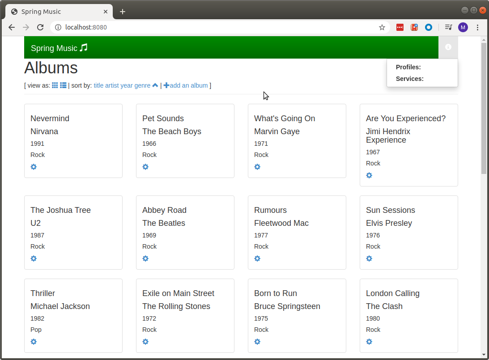

# Scenario 3
In this section we will "dockerise" our application and run it locally. You have to have `docker` installed in your environment to accomplish this section - installation of docker is not in scope of this tutorial, please refer to https://docs.docker.com/get-docker/ for more details.

## Build Docker Image
We will use the application that we've built in [Scenario 1](../scenario-01/readme.md)

If you haven't built the application in the first scenario, this is the time to do it:
```
$ ./gradlew clean assemble
```

Now we can build a Docker image. The Dockerfile is located in the root of this repo and it is listed below for your convenience.
```
FROM openjdk:8-jdk-alpine
RUN addgroup -S spring && adduser -S spring -G spring
USER spring:spring
ARG JAR_FILE=build/libs/spring-music-1.0.jar
COPY ${JAR_FILE} /home/spring/app.jar
EXPOSE 8080
ENTRYPOINT ["java","-Djava.security.egd=file:/dev/./urandom","-jar","/home/spring/app.jar"]
```

As you can see from the content of the Dockerfile it's:
 - using a minimalistic openjdk image, based on `alpine` - for more details please look [here](https://hub.docker.com/_/openjdk)
 - creating a group and a user called `spring`
 - copying the `spring-music-1.0.jar` into the image under `/home/spring` directory
 - exposing port 8080
 - using the JVM to run the jar.

To build the docker image use the following command:
```
$ docker build -t springmusic .
```
The above command will create, tag and push the newly created docker image to your local docker registry.
To see this image exist issue the following command:
```
$ docker image ls
```
The output should be something like this:
```
REPOSITORY                       TAG                 IMAGE ID            CREATED             SIZE
springmusic                      latest              6e296a2dfd95        4 hours ago         163MB
```

Well, let's start this image locally by running the following command:
```
$ docker run -it -p 8080:8080 springmusic
```
To check that it's up & running, run this command:
```
$ docker ps
```
and this is the expected output (more or less):
```
CONTAINER ID        IMAGE               COMMAND                  CREATED             STATUS              PORTS                    NAMES
2017a1b7c8d8        springmusic         "java -Djava.securit…"   41 seconds ago      Up 38 seconds       0.0.0.0:8080->8080/tcp   reverent_williams
```

Once the application is up & running, we can connect to http://localhost:8080 and should see something like that 
