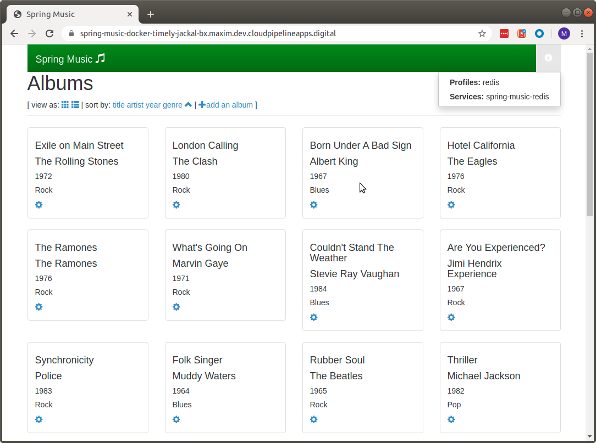

# Scenario 4
In this section we will deploy our dockerized application (that we created in scenario No.3) to Cloud Foundry instance and bind (e.g.: connect) it to one or more persistence services. To complete this scenario you will require access to a Cloud Foundry instance and Docker Hub [optional].
*Getting access to a Cloud Foundry instance and Docker Hub is out of scope for this scenario.*


## Prerequisites
There are quite a few things that we need to do before we can deploy our app to Cloud Foundry, so hang in there.

### Making sure that Docker Support is enabled.
To verify that our target Cloud Foundry instance supports deployment of dockerized applications, issue the following command:
```
$ cf feature-flag diego_docker
```
The output should return:
```
Features       State
diego_docker   enabled
```
If it's disabled, either enable it by issuing `cf enable-feature-flag diego_docker` command or ask your Cloud Foundry administrator to do it for you (in case you don't have permissions to do so).

### Making sure that the docker image is in the Docker Hub.
Cloud Foundry supports deploying applications from container registries such as Docker Hub, Google Container Registry (GSR) and Amazon Elastic Container Registry (ECR). In our example, we will be using Docker Hub registry (https://hub.docker.com/). For details about how to deploy applications from other container registries please look [here](https://docs.cloudfoundry.org/devguide/deploy-apps/push-docker.html).

Let's find out the image id of the docker image that we created in scenario No.3:
```
$ docker image ls
```
From the output below, you can see that the image id is `6e296a2dfd95`:
```
REPOSITORY                       TAG                 IMAGE ID            CREATED             SIZE
springmusic                      latest              6e296a2dfd95        4 hours ago         163MB
```

Now we need to tag it with the docker repo name that we will be using to deploy to Cloud Foundry.
I'll be using my personal Docker Hub account `barsutka`, so the command that we need to issue is:
```
docker tag 6e296a2dfd95 barsutka/springmusic:latest
```

Now we have both images (e.g.: springmusic and barsuta/springmusic) in our local registry.
The next step is to push this newly tagged image to Docker Hub.
First of all, let's log in into your Docker Hub account (if you didn't do so yet):
```
docker login --username=barsutka
```

For more details please consult https://docs.docker.com/engine/reference/commandline/login/.

once we are logged in, let's push the local image to the Docker Hub repository:
```
docker push barsutka/springmusic
```

To make sure that the image was deployed (pushed) successfully to Docker Hub, let's try to pull it by:
```
docker pull barsutka/springmusic
```

Now, we are ready to deploy to Cloud Foundry.

## Deploying the docker image to Cloud Foundry.

### Still the same `cf push`
To deploy the application as a docker image, we will be using the following command:
```
cf push spring-music-docker --docker-image barsutka/springmusic --random-route -m 1024M
```

*Note: we didn't use a manifest file as in the previous example (Scenario No.2), but we specified the same parameters (more or less) via command line.*

Once the application is up and running, Cloud Foundry will publish the URL to access this app. Here how it will look in a browser:


The following steps are the same as in Scenario No.2.

### Creating and binding services

Using the provided command line options, the application will be created without an external database (the `in-memory` profile is activated by default). You can create and bind database services to the application using the information below.

#### System-managed services

Depending on the Cloud Foundry service provider, persistence services might be offered and managed by the platform. These steps can be used to create and bind a service that is managed by the platform:

~~~
# view the services available
$ cf marketplace
# create a service instance
$ cf create-service <service> <service plan> <service name>
# bind the service instance to the application
$ cf bind-service <app name> <service name>
# restart the application so the new service is detected
$ cf restart
~~~

In my environment I created a redis service instance and connected it (`cf bind-service`) to the app.
This is how the app looks in my browser:


#### Changing bound services

To test the application with different services, you can simply stop the app, unbind a service, bind a different database service, and start the app:

~~~
$ cf unbind-service <app name> <service name>
$ cf bind-service <app name> <service name>
$ cf restart
~~~

#### Database drivers

Database drivers for MySQL, Postgres, MongoDB, and Redis are included in the project.
